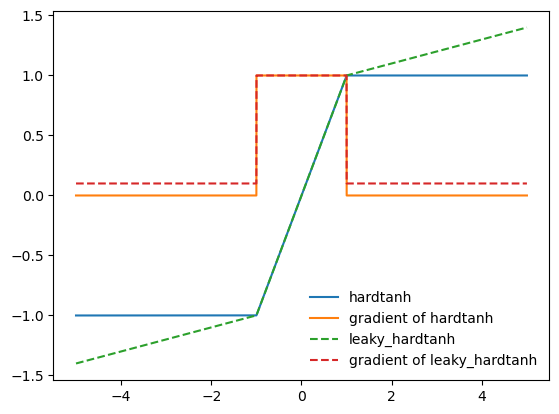

# leaky_hardtanh

Pytorch implemenation of the leaky version of the hard hyperbolic tangent (`hardtan`h) function. For the non-leaky `hardtanh` defnition, see the PyTorch documentation [here](https://pytorch.org/docs/stable/generated/torch.nn.Hardtanh.html).

In comparison to `hardtanh` the `leaky_hardtanh` has a defined (non-zero) gradient outside the linear region. This is an equivalent change as moving from the `ReLU` activation function to the `LeakyReLU` activation. 

The best usage for the activation function is likly to add a soft inductive bias to a model by implying an optimal output region between `min_val` and `max_val`. Yet gradients outside this region are still well defined.

See below for a comparison of the gradients of `leaky_hardtanh` vs `hardtanh`:

Please note that this code uses the `torch.where` implementation, which is comparatively slow. Therefore executing `leaky_hardtanh` is about 7x slower than using `leaky_relu`. Hence it is suggested to use this activation either in only small neural networks or better only as the output actiation. 
